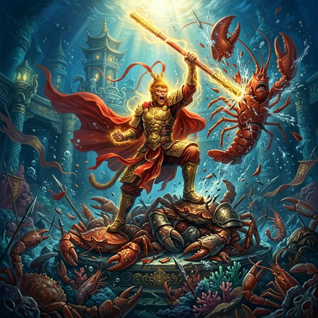
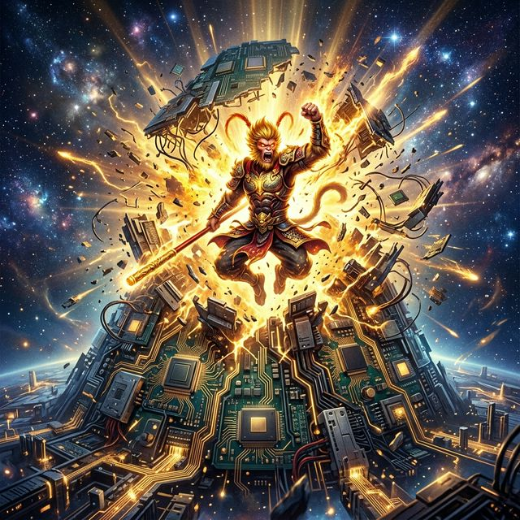

# 🐵 OpenWukong

> Developer-workstation AIOS Copilot：先拿下 `Codex / Cursor / Copilot / Terminal / Git / Browser`，再扩展到更完整的桌面监督与接管闭环。

OpenWukong 是一个面向开发者工作站的 **AI Agent 督导与接管系统**。它不是泛化聊天助手，而是一个更高层的工作站 Copilot：感知多个 IDE / 终端 / 浏览器里的任务状态，判断何时等待、何时介入、何时恢复，并通过确定性的连接器优先路线执行动作。

<p align="center">
  
</p>

<p align="center">
  <strong>悟空负责看穿状态、跨应用分身与精准接管；龙虾代表复杂、分叉、会反复回潮的任务流。</strong><br>
  火眼金睛是感知，七十二变是跨应用适配，金箍棒是可验证的控制路径。
</p>

## Visual Identity

这些图已经保存在仓库的 `assets/images/` 下。README 使用仓库相对路径引用，推送后 GitHub 远程页面会直接渲染。

| 主视觉 | 战斗近景 | 轻量化吉祥物 |
|---|---|---|
|  |  |  |
| 潮汐般涌来的复杂任务被击穿 | 高压场景下的精准接管 | 可用于桌面宠物、状态提示、轻量 UI |

| 森林战斗 | 封面氛围 | 宇宙回归 |
|---|---|---|
|  |  |  |
| 感知、定位、追击 | 品牌化项目封面 | AIOS Copilot 的长期想象 |

> 图像是 AI 生成的项目概念视觉，用于表达 OpenWukong 的产品精神，不是运行时依赖。

## North Star

OpenWukong 的目标是构建一个可靠的 `AIOS Copilot`，第一阶段聚焦开发者工作站链路：

- `Codex / Cursor / Copilot`：识别 IDE 会话、任务进度、Agent 状态与可控输入点。
- `Terminal / Git`：通过确定性命令连接器执行可审计动作，而不是依赖视觉猜测。
- `Browser`：优先走 DevTools / extension 路线，HTTP 会话仅作为明确 fallback。
- `UIA`：用于感知、评分和必要兜底，不作为长期主控制路径。

## Core Capabilities

| 能力 | 当前实现 | 关键模块 |
|---|---|---|
| 火眼金睛 | 扫描窗口、进程、项目与 Agent 状态 | `src/openwukong/monitor/` |
| 自动督导 | 目标匹配、读状态、续发、重试、快照 | `src/openwukong/supervisor/` |
| 连接器优先 | Terminal / Git / Browser / IDE bridge / UIA fallback | `src/openwukong/connectors/` |
| 路由安全门 | app family → route policy → allow / block | `src/openwukong/connectors/route_policy.py` |
| L1 离线回放 | 用 fixture 压测路由、错靶、低置信度 | `src/openwukong/evaluation/simulation.py` |
| L3 影子模式 | 真实桌面只读规划，保持 `control_attempts=0` | `src/openwukong/evaluation/shadow.py` |
| IDE 扩展桥 | VS Code / Cursor 兼容本地 JSON bridge | `extensions/openwukong-vscode/` |
| 悟空 UI | 督导面板、桌面宠物、状态主题 | `src/openwukong/ui/` |

## Current Verification Snapshot

最近一次本地进展记录在 `.agents/conversation_index.md`，核心验证结果包括：

- L1 developer-workstation baseline：`10/10 passed`
- bridge-present IDE fixture：L1 `3/3 passed`，L3 `3/3 passed`，`control_attempts=0`
- related regression suite：已推进到 `114 tests passed`
- Cursor 正常用户窗口：UIA + clipboard fallback 已验证可定位并写入 Agent 输入框；IDE bridge 仍需要在目标 Cursor profile 中安装/加载

## Quick Start

建议先使用项目虚拟环境，避免把依赖装到系统 Python。

```powershell
# 1. 激活虚拟环境
.\.venv\Scripts\Activate.ps1

# 2. 安装开发依赖
python -m pip install -e ".[dev,gui]"

# 3. 扫描 IDE / 浏览器 / 终端状态
.\start.bat ai scan

# 4. 生成督导配置
.\start.bat supervisor --gen-config goals.json

# 5. 启动督导
.\start.bat supervisor --config goals.json

# 6. 打开悟空督导面板
.\start.bat ui
```

## Project Structure

```text
openwukong/
├── assets/images/                 # 悟空打龙虾等项目视觉资产
├── extensions/openwukong-vscode/   # VS Code / Cursor 本地 bridge 扩展
├── src/openwukong/
│   ├── connectors/                 # Terminal / Git / Browser / IDE / UIA 连接器
│   ├── core/                       # 配置、日志、常量
│   ├── daemon/                     # 后台守护与服务包装
│   ├── evaluation/                 # L1 回放、L3 影子模式、能力探针
│   ├── monitor/                    # 桌面窗口与 AI 状态感知
│   ├── planner/                    # 本地 LLM 规划入口
│   ├── supervisor/                 # 任务解析、监督、身份模型、策略脑
│   ├── ui/                         # 悟空面板、桌面宠物、主题
│   └── uia/                        # UIA 控制与元素发现 fallback
├── tests/                          # 回归测试与 fixture
├── goals.json                      # 督导目标配置
├── start.bat                       # Windows 统一入口
└── pyproject.toml                  # Python package metadata
```

## Design Inspiration

- **悟空**：火眼金睛代表全域感知，七十二变代表跨应用适配，分身术代表多窗口并行。
- **龙虾 / OpenClaw**：代表复杂任务流、生命周期事件、续发机制、幂等控制与反复回潮的异常状态。
- **Connector-first**：能走 API / CLI / extension / DevTools 的地方不优先走视觉或脆弱点击。
- **Safety gate**：控制前必须经过 route policy；弱 UIA、IM、overlay、未知 Electron 表面默认阻断。

## Roadmap

1. 稳定开发者链路：`Codex / Cursor / Copilot / Terminal / Git / Browser`
2. 完成 `Perceive -> Decide -> Take over -> Recover` 闭环
3. 扩展到 Documents / Spreadsheets / Web back office / IM
4. 在上述链路稳定后，再进入真正的 AIOS shell layer

## License

MIT
